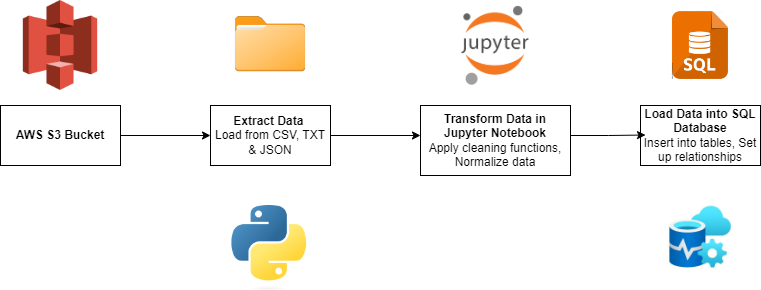

# Data 402 Final Project


## Table of Contents
- [Introduction](#introduction)
- [Setup instructions](#setup-instructions)
- [Extraction](#extraction)
- [Transformation](#transformation)
- [Loading](#loading)
- [Data Schema](#data-schema)
- [Testing](#testing)
- [Troubleshooting](#troubleshooting)
- [Licensing](#licensing)
- [Collaborators](#collaborators)
- [Acknowledgements](#acknowledgements)


## Introduction

### Project overview 

**Task:** 

Create an ETL pipeline from mock data from a fictionalised version of Sparta global and generate some analytical insights to present to stakeholders. 

**Task Requirements:**

- The code needs to be at production-level (easily reuseable). 

- Have an appropriate data store that will house all the data drawn from the files, the database should provide a single-person view. 

 

**Prerequisites:**

The following requirements have to be met for the ETL pipeline to run successfully:

- Ensure the latest version of python has been installed. 

- Ensure you have PyCharm, Docker and Azure studio installed and running correctly. 

- Required python libraries to import: boto3, pandas, NumPy, pytest, json, SQL alchemy (requirements.txt). 

- Credentials to access the ‘data-402-final-project’ S3 bucket needs to be requested from Sparta Global. 

### Data Pipeline Diagram
To provide a clear overview of the ETL process, below is a diagram illustrating the various steps involved in the pipeline:



## Setup instructions 

### 1. Install required software 

- Install Python: Python Releases for Windows | Python.org 

- Install PyCharm: Download PyCharm: The Python IDE for data science and web development by JetBrains 

- Install Docker: Install Docker Engine | Docker Docs 

- Install Azure Data Studio: Download and install Azure Data Studio - Azure Data Studio | Microsoft Learn

### 2. Install ODBS Driver


### 3. Clone the project repository to your local machine 

- $ git clone … 


### 4. Install the required python libraries on the Windows PowerShell/terminal 

- pip install -r requirements.txt 

### 5. Run scripts 

- Extraction script 

- Transformation script 

- Load script 

- Merge script 

- Test script 


## Extraction
The Sparta global mock data was extracted from the Amazon S3 bucket 'data-402-final-project bucket which contained two further prefixes Talent and academy. 

Talent contents: Data collected on the Sparta day event, contains information about candidate competency, the outcome of behaviour and their performance and various recruitment tests.
- .json
- .csv
- .txt  

Academy contents: Data collected from all the Spartans in the academy, with their names, courses and what score they were getting in their weekly tests.
- .csv 

## Transformation

Image to show which columns are found in the different files:


### JSON files: 

- The Talent JSON files were loaded into a pandas DataFrame 

- NaN values were identified  in the tech_self_score column and were converted into an empty dictionary string, ‘{}'. 

- We also converted the strengths and weaknesses columns to strings. 

- Duplicate rows were identified and dropped. 

### Academy CSV files: 

- The academy CSV files were loaded into a pandas DataFrame 

- Whitespace was cleaned before and after the entry of each string. 

- The category, stream name and start data from each CSV filenames were extracted and assigned to corresponding candidates. 

- Checked for duplicate and null values but there were none. 

### Talent CSV files: 

- The talent CSV files were loaded into a pandas DataFrame 

- Special characters such as "-", " ", "(", and ")" were removed from the phone number column. 

- All the month names were standardised to the format "full month name-year" (e.g., "September-2019"). 

- The ‘invite_date’ (date of the month of their Sparta day) and ‘month’ was merged into a single column specifying ‘sparta_day_date’, ensuring it is of type ‘datetime.date’. 

- The ‘invite_date’ and ‘month’ columns were dropped. 

- The ‘dob’ (date of birth) column was enforced with the ‘datetime.date’ type for proper date interpretation. 

- Ensured the correct capitalisation of names in "First Last" format and street addresses. 

- All the leading and trailing whitespaces for all columns were removed. 


### Talent TXT files: 

- The talent txt files were loaded into a pandas DataFrame. 

- Whitespace characters were removed from the ‘date’, ‘name’ and ‘academy column  

- The ‘psychometric_score’ and ‘presentation_score’ columns were converted into the integer data type 

- Checked for duplicate and null values but there were none. 

- The ‘date’ column was converted into the ‘datetime.date’ format 

## Loading

After extracting and transforming the data, the final step in our ETL pipeline is loading the cleaned data into our database for further analysis and reporting. This process involves the following steps:

### 1. Setup the Database:

- We used **Azure Data Studio** to create a database named **FinalProject**. This database is hosted on a **SQL Edge** server.

### 2. Docker Container:

- A **Docker** container was run to host the SQL Edge server. The connection details were configured as follows:

```
connection_string = (
    'Driver=ODBC Driver 17 for SQL Server;'
    'Server=127.0.0.1;'
    'Database=FinalProject;'
    'UID=<username>;'
    'PWD=<password>>;'
    'Trusted_Connection=no;'
)
```

### 3. Python Script:

  - A **Python** script was used to load the transformed data into the SQL database. This script reads the data from four cleaned dataframes (**Talent_CSV**, **Talent_TXT**, **Talent_JSON**, **Academy_CSV**) and inserts them into the FinalProject database as individual tables.

Here is a high-level overview of the Python script:

- Dependencies:

  - The script utilises various libraries including **boto3** for **S3** interactions, **pandas** for data manipulation, and **sqlalchemy** for database operations.

- Connection Setup:

  - The script sets up a connection to the SQL database using SQLAlchemy.

- Data Loading Functions:

  - Four functions are defined to load and clean data from different sources (JSON, CSV, TXT):

    - `clean_academy_csv()`: Loads and cleans data from the Academy CSV files.
    - `clean_talent_json()`: Loads and cleans data from the Talent JSON files.
    - `clean_talent_csv()`: Loads and cleans data from the Talent CSV files.
    - `clean_talent_txt()`: Loads and cleans data from the Talent TXT files.
    

- Insert Data into SQL:

  - The cleaned dataframes are inserted into the SQL database using the `insert_into_sql()` function, which uses the `to_sql` method from pandas to perform the insertion.
  

- Main Execution:

  - The script's main block orchestrates the loading process, invoking the cleaning functions and then inserting the results into the database tables.

```commandline
import boto3
import datetime
import json
import re
from io import StringIO

import numpy as np
import pandas as pd
import sqlalchemy as sa

# Set up S3 client
s3 = boto3.client('s3')

# Connection string to SQL Server
connection_string = (
    'Driver=ODBC Driver 17 for SQL Server;'
    'Server=127.0.0.1;'
    'Database=FinalProject;'
    'UID=<username>;'
    'PWD=<password>;'
    'Trusted_Connection=no;'
)
connection_url = sa.engine.URL.create(
    "mssql+pyodbc",
    query=dict(odbc_connect=connection_string)
)
engine = sa.create_engine(connection_url, fast_executemany=True)

# Function definitions for loading and cleaning data...

# Insert data into SQL function
def insert_into_sql(dataframe, engine, tablename):
    dataframe.to_sql(tablename, engine, schema="dbo", if_exists="replace", index=False)
    return

if __name__ == "__main__":
    # Process Academy CSV data
    print("Processing academy csv data!")
    academy_data = clean_academy_csv()
    insert_into_sql(academy_data, engine, "Academy_CSV")
    print("Successfully inserted academy csv data!")

    # Process Talent JSON data
    print("Processing talent json data!")
    talent_json = clean_talent_json()
    insert_into_sql(talent_json, engine, "Talent_JSON")
    print("Successfully inserted talent json data!")

    # Process Talent CSV data
    print("Processing talent csv data!")
    talent_csv = clean_talent_csv()
    insert_into_sql(talent_csv, engine, "Talent_CSV")
    print("Successfully inserted talent csv data!")

    # Process Talent TXT data
    print("Processing talent txt data!")
    talent_txt = clean_talent_txt()
    insert_into_sql(talent_txt, engine, "Talent_TXT")
    print("Successfully inserted talent txt data!")
```
## 4. Normalization and Relationships:

- After loading the data into the SQL database, the data was further normalized to ensure efficiency and integrity. **Primary Keys** (PKs), **Foreign Keys** (FKs), and **junction tables** were established to create relationships between the data tables, ensuring a single view of each candidate.

By following this process, we ensure that our data is stored in a well-structured and efficient manner, ready for any further analysis and reporting required.


## Data Schema

The database schema for the Final Project ETL pipeline consists of multiple interconnected tables designed to store and manage the extracted and transformed data efficiently. Below is a description of each table, including its columns and relationships:

### Entity Relationship Diagram


### APPLICANTS

- `applicant_ID (PK)`: Unique identifier for each applicant.
- `sparta_day_ID (FK)`: References `sparta_day_ID` in the `SPARTA_DAY` table.
- `self_development`: Self-development score.
- `geo_flex`: Geographic flexibility indicator.
- `financial_support_self`: Financial self-support indicator.
- `result`: Result of the application process.
- `course_interest`: Interested course.
- `gender`: Gender of the applicant.
- `psychometric_score`: Psychometric score.
- `presentation_score`: Presentation score.
- `dob`: Date of birth.
- `email`: Email address.
- `address_ID (FK)`: References `address_ID` in the `ADDRESS` table.
- `phone_number`: Phone number.
- `uni_ID (FK)`: References `uni_ID` in the `UNI` table.
- `degree_grade`: Degree grade.
- `talent_coordinator_ID`: Identifier for the talent coordinator.

### CATEGORIES
- `category_id (PK)`: Unique identifier for each category.
- `category_name`: Name of the category.

### TRAINERS
- `trainer_id (PK)`: Unique identifier for each trainer.
- `name`: Name of the trainer.

### STREAMS
- `stream_ID (PK)`: Unique identifier for each stream.
- `category_id (FK)`: References `category_id` in the `CATEGORIES` table.
- `trainer_ID (FK)`: References `trainer_id` in the `TRAINERS` table.
- `start_date`: Start date of the stream.

### STREAMS_JUNCTION
- `stream_ID (FK)`: References `stream_ID` in the `STREAMS` table.
- `applicant_ID (FK)`: References `applicant_ID` in the `APPLICANTS` table.

### LOCATION
- `location_ID (PK)`: Unique identifier for each location.
- `location`: Name of the location.

### SPARTA_DAY
- `sparta_day_ID (PK)`: Unique identifier for each Sparta day.
- `date`: Date of the Sparta day.
- `location_ID (FK)`: References `location_ID` in the `LOCATION` table.

### ADDRESS
- `address_ID (PK)`: Unique identifier for each address.
- `address_name`: Name of the address.
- `city_name`: Name of the city.
- `postcode_name`: Postcode of the address.

### UNI
- `uni_ID (PK)`: Unique identifier for each university.
- `name`: Name of the university.

### TECH_SKILL_APPLICANT
- `applicant_ID (PK, FK1)`: References `applicant_ID` in the `APPLICANTS` table.
- `tech_skill_ID (PK, FK2)`: References `tech_skill_ID` in the TECH_SKILL table.
- `score`: Skill score for the applicant.

### TECH_SKILL
- `tech_skill_ID (PK)`: Unique identifier for each technical skill.
- `tech_skill_name`: Name of the technical skill.

### SCORE
- `applicant_ID (FK)`: References `applicant_ID` in the `APPLICANTS` table.
- `assessors_ID (FK)`: References `assessors_ID` in the `ASSESSORS` table.
- `week`: Week number.
- `score`: Score for the week.

### ASSESSORS
- `assessors_ID (PK)`: Unique identifier for each assessor.
- `name`: Name of the assessor.

### WEAKNESS_JUNCTION
- `applicant_ID (FK)`: References `applicant_ID` in the `APPLICANTS` table.
- `weakness_ID (FK)`: References `weakness_ID` in the `WEAKNESSES` table.

### WEAKNESSES
- `weakness_ID (PK)`: Unique identifier for each weakness.
- `weakness_name`: Name of the weakness.

### STRENGTH_JUNCTION
- `applicant_ID (FK)`: References applicant_ID in the APPLICANTS table.
- `strength_ID (FK)`: References `strength_ID` in the `STRENGTHS` table.

### STRENGTHS
- `strength_ID (PK)`: Unique identifier for each `strength`.
- `strength_name`: Name of the strength.

### TALENT_COORDINATORS
- `talent_coordinator_ID (PK)`: Unique identifier for each talent coordinator.
- `name`: Name of the talent coordinator.


## Relationships
`APPLICANTS` is related to `SPARTA_DAY`, `ADDRESS`, and `UNI` through foreign keys.

`STREAMS` is related to `CATEGORIES` and `TRAINERS` through foreign keys.

`STREAMS_JUNCTION` serves as a junction table linking `STREAMS` and `APPLICANTS`.

`SPARTA_DAY` is related to `LOCATION` through a foreign key.

`TECH_SKILL_APPLICANT` serves as a junction table linking `APPLICANTS` and `TECH_SKILL`.

`SCORE` links `APPLICANTS` and `ASSESSORS`.

`WEAKNESS_JUNCTION` and `STRENGTH_JUNCTION` serve as junction tables linking `APPLICANTS` to their respective strengths and weaknesses.

This schema ensures that all relevant data is stored in a normalized form, facilitating efficient querying and data integrity.

## Collaborators


| Name                          |
|-------------------------------|
| Dafydd Lloyd                  |
| Jacqueline Onyemechi Ochonma  |
| James O'Brien (Product Owner) |
| Kazim Raza                    |
| Kehinde Giwa                  |
| Kyun Philip-Lessells          |
| Sabrina Kaur (Scrum Master)   |
| Samuel Smith (Scrum Master)   |
| Yoonhee Lee                   |
| Luis Rodriguez Valido         |
| Rajpal Aujla                  |


## Testing

## Troubleshooting

## Licensing

This project is the intellectual property of Sparta Global. As trainee data engineers at Sparta Global, our work including data extraction, transformation, and loading (ETL) processes utilised resources from Sparta Global's infrastructure, including the use of their S3 bucket for data storage. All rights, including but not limited to intellectual property rights, remain with Sparta Global.

For licensing inquiries or further information, please contact Sparta Global directly.

## Acknowledgements 

We would like to extend our gratitude to the following individuals for their invaluable contributions to this project:

### Data402 Group Members at Sparta Global
- Dafydd Lloyd
- Jacqueline Onyemechi Ochonma
- James O'Brien
- Kazim Raza
- Kehinde Giwa
- Kyun Philip-Lessells
- Sabrina Kaur
- Samuel Smith
- Yoonhee Lee
- Luis Rodriguez Valido
- Rajpal Aujla

### Trainers
- Luke Fairbrass
- Paula Savaglia

Thank you all for your dedication and support throughout the development of this project.


